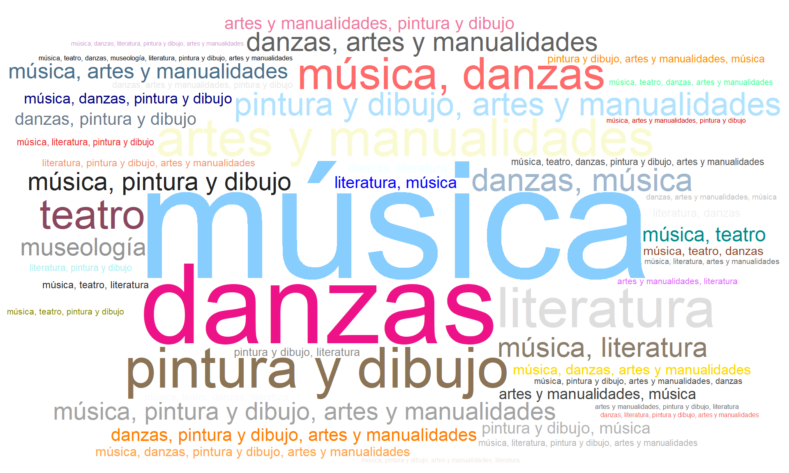
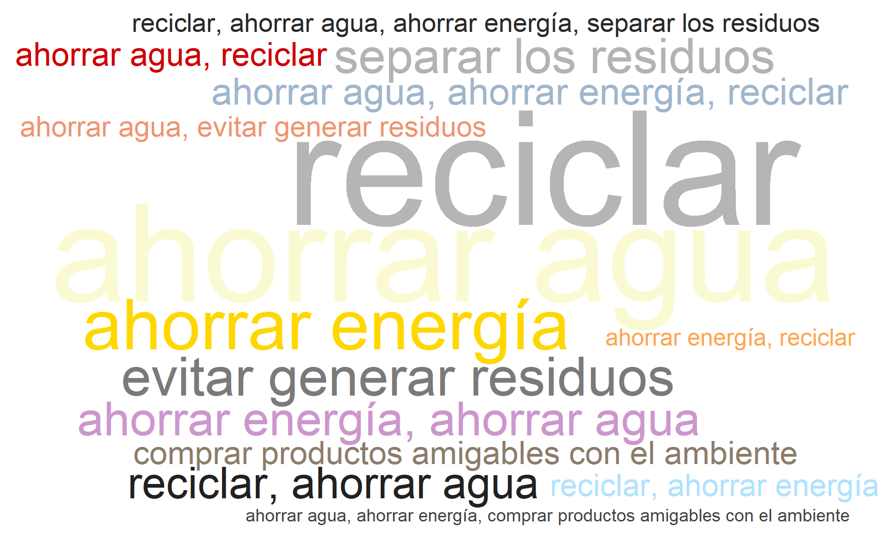
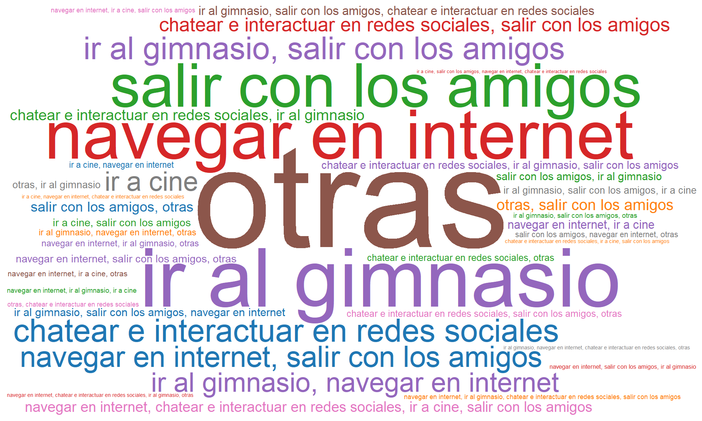
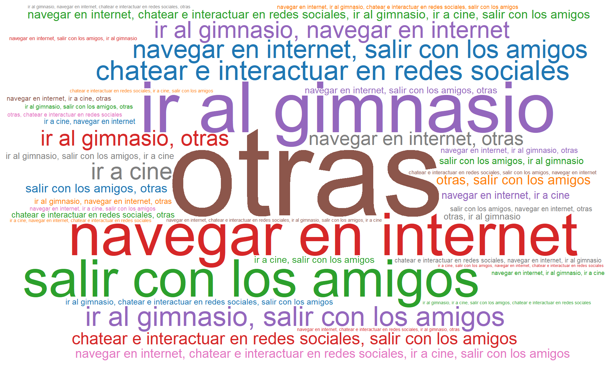
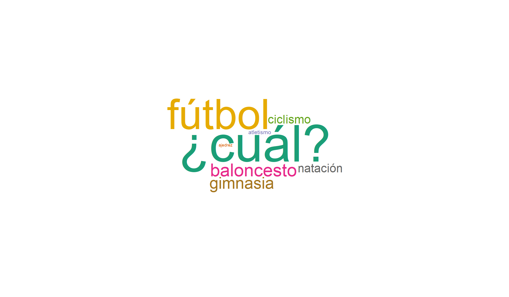
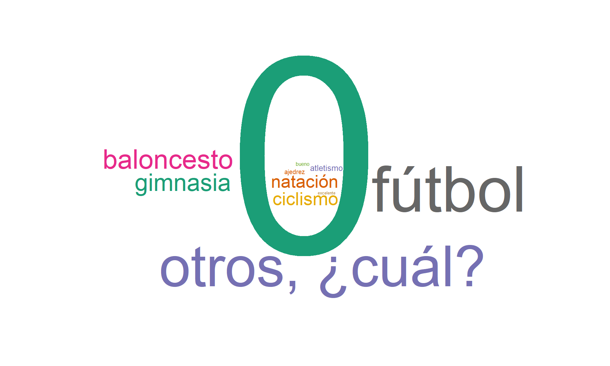
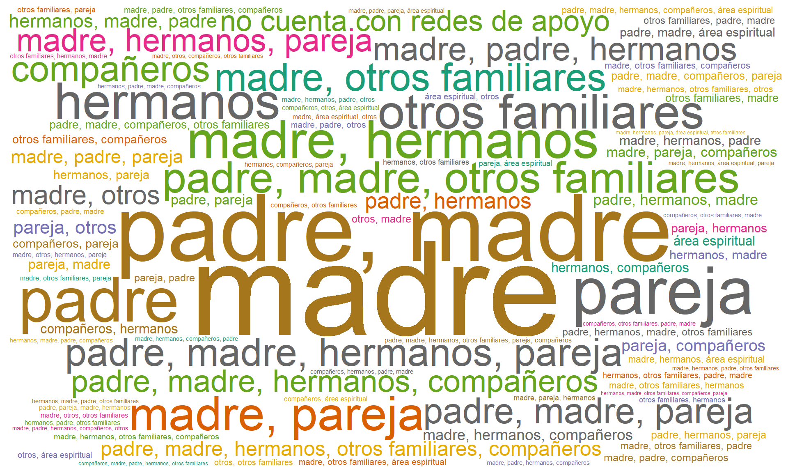
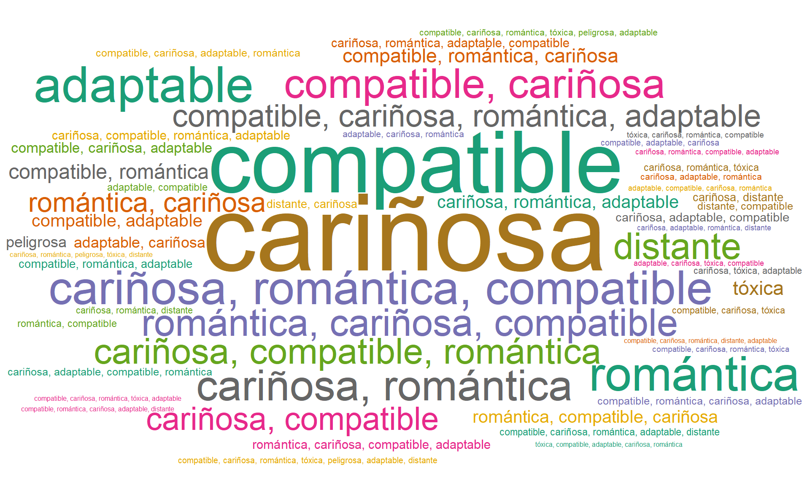

::: {.cell}
::: {.cell-output .cell-output-stdout}

```
[1] 1195  155
```


:::
:::


::: {.cell}

:::


::: {.callout-warning title="Aclaración importante"}
En los gráficos y filtros, el nombre Cúcuta aparecerá como Cucuta.
:::

## Sesión: Fomento de la cultura

### ¿Cuáles de las siguientes disciplinas artísticas le atrae?

::: {.callout-note title="Descripción para todos los campus"}
La nube de palabras muestra que las áreas de mayor interés son **música** y **danzas**, seguidas por **pintura y dibujo** y **artes y manualidades**, que también presentan alta frecuencia. En menor proporción aparecen **literatura** y **teatro**, junto con menciones puntuales a **museología**.
:::


::: {.cell}
::: {.cell-output-display}
{width=960}
:::
:::


### ¿Cuenta con alguna habilidad artística?

::: {.callout-note title="Descripción para todos los campus"}
Alrededor del **29,6% de los estudiantes afirma tener alguna habilidad artística**, mientras que la mayoría, equivalente al **70,4%, no se identifica con este tipo de capacidades**. Estos resultados muestran que, aunque la proporción de estudiantes con inclinaciones artísticas no es mayoritaria, sí existe un grupo significativo que puede aportar a la vida cultural universitaria.
:::


::: {.cell}
::: {.cell-output-display}

```{=html}
<div class="plotly html-widget html-fill-item" id="htmlwidget-c9a4c2a774cafd4c5223" style="width:100%;height:464px;"></div>
<script type="application/json" data-for="htmlwidget-c9a4c2a774cafd4c5223">{"x":{"visdat":{"213c47f5647":["function () ","plotlyVisDat"]},"cur_data":"213c47f5647","attrs":{"213c47f5647":{"labels":{},"values":{},"textinfo":"label+percent","hoverinfo":"label+percent+value","marker":{"colors":["#FBB4AE","#B3CDE3","#CCEBC5","#DECBE4","#FED9A6","#FFFFCC","#E5D8BD","#FDDAEC"]},"rotation":270,"transforms":[{"type":"filter","target":{},"operation":"=","value":"Todos"}],"alpha_stroke":1,"sizes":[10,100],"spans":[1,20],"type":"pie"}},"layout":{"margin":{"b":40,"l":60,"t":25,"r":10},"title":"","updatemenus":[{"type":"dropdown","active":0,"buttons":[{"method":"restyle","args":["transforms.0.value","Todos"],"label":"Todos"},{"method":"restyle","args":["transforms.0.value","Bucaramanga"],"label":"Bucaramanga"},{"method":"restyle","args":["transforms.0.value","Cucuta"],"label":"Cucuta"},{"method":"restyle","args":["transforms.0.value","Valledupar"],"label":"Valledupar"}]}],"hovermode":"closest","showlegend":true},"source":"A","config":{"modeBarButtonsToAdd":["hoverclosest","hovercompare"],"showSendToCloud":false},"data":[{"labels":["No","Sí","No","Sí","No","Sí","No","Sí"],"values":[375,171,243,102,201,77,841,354],"textinfo":"label+percent","hoverinfo":["label+percent+value","label+percent+value","label+percent+value","label+percent+value","label+percent+value","label+percent+value","label+percent+value","label+percent+value"],"marker":{"color":"rgba(31,119,180,1)","colors":["#FBB4AE","#B3CDE3","#CCEBC5","#DECBE4","#FED9A6","#FFFFCC","#E5D8BD","#FDDAEC"],"line":{"color":"rgba(255,255,255,1)"}},"rotation":270,"transforms":[{"type":"filter","target":["Bucaramanga","Bucaramanga","Cucuta","Cucuta","Valledupar","Valledupar","Todos","Todos"],"operation":"=","value":"Todos"}],"type":"pie","frame":null}],"highlight":{"on":"plotly_click","persistent":false,"dynamic":false,"selectize":false,"opacityDim":0.20000000000000001,"selected":{"opacity":1},"debounce":0},"shinyEvents":["plotly_hover","plotly_click","plotly_selected","plotly_relayout","plotly_brushed","plotly_brushing","plotly_clickannotation","plotly_doubleclick","plotly_deselect","plotly_afterplot","plotly_sunburstclick"],"base_url":"https://plot.ly"},"evals":[],"jsHooks":[]}</script>
```

:::
:::


### Habilidad artística que posee.

::: {.callout-note title="Descripción para todos los campus"}
La nube de palabras muestra que la habilidad predominante es el **dibujo**, seguida por **pintura** y **danza**. También destacan actividades musicales como **canto**, **bailar** y **tocar instrumentos**. En menor medida aparecen **escritura**, **guitarra** y otras expresiones creativas.
:::


::: {.cell}
::: {.cell-output-display}

```{=html}
<div class="wordcloud2 html-widget html-fill-item" id="htmlwidget-d33a5e10c356cf688d8a" style="width:100%;height:464px;"></div>
<script type="application/json" data-for="htmlwidget-d33a5e10c356cf688d8a">{"x":{"word":["dibujo","pintura","manualidades","danza","dibujar","pintar","canto","tocar","baile","música","bailar","piano","cantar","danzas","escritura","instrumentos","toco","artes","guitarra","gusta","instrumento","creatividad","escribir","literatura","musica","arte","creativa","diseño","teatro","acordeon","bajo","hacer","músico","tocó","violín","acordeón","actuar","aprender","arcilla","bien","bueno","caja","clarinete","composición","creación","crear","cualquier","danzar","deportes","dibujos","gráfico","interpretar","joropo","manejo","nivel","ocasionalmente","percusión","poemas","porcelana","actuación","acuarela","aficionado","artista","artísticas","atrae","atrevido","audiovisuales","año","bailarina","bailarín","bailo","banda","bisutería","blanco","bordado","bordar","buen","buena","básico","cantante","carboncillo","colorear","cometas","composiciones","conceptual","copiar","corporal","cosa","creativaaveces","crochet","decoracion","decoraciones","deporte","deportista","deportiva","desarrollo","detalles","dibujando","dibujaspintarcantarhacer","dibujó","dificultad","digital","ejecución","electrica","electrico","eléctrico","embargo","escribo","escultura","escénica","etcétera","experimentar","expresión","facilita","flores","folclóricas","fría","fútbol","general","gimnasia","gustaría","haciendo","hago","historias","ilustracion","ilustración","instrumental","intento","jugaba","largos","limpiapias","manera","maquillaje","mido","musical","musicales","muñecos","músical","natación","negro","nuevo","oral","oratoria","origami","personajes","pertenecí","pintarredactarcreatividad","pinto","poesía","principiante","produccion","práctico","realista","realizar","recortar","recreativa","rendirme","retratos","saber","saxofón","sinfónica","sé","tejer","textos","tipo","tocaba","toque","trombonista","trombón","vallenata","varios","virtual","worldbuilding","óleo"],"freq":[78,48,39,36,32,24,22,22,17,17,15,14,12,12,10,10,8,7,7,7,6,5,5,5,5,4,4,4,4,3,3,3,3,3,3,2,2,2,2,2,2,2,2,2,2,2,2,2,2,2,2,2,2,2,2,2,2,2,2,1,1,1,1,1,1,1,1,1,1,1,1,1,1,1,1,1,1,1,1,1,1,1,1,1,1,1,1,1,1,1,1,1,1,1,1,1,1,1,1,1,1,1,1,1,1,1,1,1,1,1,1,1,1,1,1,1,1,1,1,1,1,1,1,1,1,1,1,1,1,1,1,1,1,1,1,1,1,1,1,1,1,1,1,1,1,1,1,1,1,1,1,1,1,1,1,1,1,1,1,1,1,1,1,1,1,1,1,1,1,1,1,1,1,1],"fontFamily":"Segoe UI","fontWeight":"bold","color":"random-light","minSize":0,"weightFactor":2.307692307692307,"backgroundColor":"white","gridSize":0,"minRotation":-0.7853981633974483,"maxRotation":0.7853981633974483,"shuffle":true,"rotateRatio":0.4,"shape":"circle","ellipticity":0.65,"figBase64":null,"hover":null},"evals":[],"jsHooks":{"render":[{"code":"function(el,x){\n                        console.log(123);\n                        if(!iii){\n                          window.location.reload();\n                          iii = False;\n\n                        }\n  }","data":null}]}}</script>
```

:::
:::


### ¿Le gustaría dedicar tiempo de su actividad académica o laboral para aprender o fortalecer sus habilidades artísticas?

::: {.callout-note title="Descripción para todos los campus"}
Un **70.5% de los estudiantes manifestó interés en dedicar tiempo de su vida académica o laboral** para aprender o fortalecer sus habilidades artísticas, frente a un 29.5% que no lo considera. Este hallazgo evidencia una oportunidad para ampliar la oferta de programas extracurriculares de formación artística dentro de la universidad.
:::


::: {.cell}
::: {.cell-output-display}

```{=html}
<div class="plotly html-widget html-fill-item" id="htmlwidget-35847d2a0b45a20ecd10" style="width:100%;height:464px;"></div>
<script type="application/json" data-for="htmlwidget-35847d2a0b45a20ecd10">{"x":{"visdat":{"213c4a4e7d55":["function () ","plotlyVisDat"]},"cur_data":"213c4a4e7d55","attrs":{"213c4a4e7d55":{"labels":{},"values":{},"textinfo":"label+percent","hoverinfo":"label+percent+value","marker":{"colors":["#FBB4AE","#B3CDE3","#CCEBC5","#DECBE4","#FED9A6","#FFFFCC","#E5D8BD","#FDDAEC"]},"rotation":270,"transforms":[{"type":"filter","target":{},"operation":"=","value":"Todos"}],"alpha_stroke":1,"sizes":[10,100],"spans":[1,20],"type":"pie"}},"layout":{"margin":{"b":40,"l":60,"t":25,"r":10},"title":"","updatemenus":[{"type":"dropdown","active":0,"buttons":[{"method":"restyle","args":["transforms.0.value","Todos"],"label":"Todos"},{"method":"restyle","args":["transforms.0.value","Bucaramanga"],"label":"Bucaramanga"},{"method":"restyle","args":["transforms.0.value","Cucuta"],"label":"Cucuta"},{"method":"restyle","args":["transforms.0.value","Valledupar"],"label":"Valledupar"}]}],"hovermode":"closest","showlegend":true},"source":"A","config":{"modeBarButtonsToAdd":["hoverclosest","hovercompare"],"showSendToCloud":false},"data":[{"labels":["No","Sí","No","Sí","No","Sí","No","Sí"],"values":[163,383,104,241,81,197,352,843],"textinfo":"label+percent","hoverinfo":["label+percent+value","label+percent+value","label+percent+value","label+percent+value","label+percent+value","label+percent+value","label+percent+value","label+percent+value"],"marker":{"color":"rgba(31,119,180,1)","colors":["#FBB4AE","#B3CDE3","#CCEBC5","#DECBE4","#FED9A6","#FFFFCC","#E5D8BD","#FDDAEC"],"line":{"color":"rgba(255,255,255,1)"}},"rotation":270,"transforms":[{"type":"filter","target":["Bucaramanga","Bucaramanga","Cucuta","Cucuta","Valledupar","Valledupar","Todos","Todos"],"operation":"=","value":"Todos"}],"type":"pie","frame":null}],"highlight":{"on":"plotly_click","persistent":false,"dynamic":false,"selectize":false,"opacityDim":0.20000000000000001,"selected":{"opacity":1},"debounce":0},"shinyEvents":["plotly_hover","plotly_click","plotly_selected","plotly_relayout","plotly_brushed","plotly_brushing","plotly_clickannotation","plotly_doubleclick","plotly_deselect","plotly_afterplot","plotly_sunburstclick"],"base_url":"https://plot.ly"},"evals":[],"jsHooks":[]}</script>
```

:::
:::


### ¿Qué día de la semana tiene más disponibilidad de tiempo, para dedicarle a éste aprendizaje artístico?

::: {.callout-note title="Descripción para todos los campus"}
A la pregunta sobre **qué día de la semana tienen mayor disponibilidad de tiempo para dedicar al aprendizaje artístico**, los resultados muestran que el **sábado** concentra la mayor proporción (**28.5%**), seguido por el **lunes (16.8%)** y el **viernes (15%)**. En un nivel intermedio se encuentran el **domingo (12.2%)** y el **miércoles (11.5%)**, mientras que **jueves** y **martes** presentan las menores disponibilidades (≈8%).
:::


::: {.cell}
::: {.cell-output-display}

```{=html}
<div class="plotly html-widget html-fill-item" id="htmlwidget-fb46c0799142080a93b0" style="width:100%;height:464px;"></div>
<script type="application/json" data-for="htmlwidget-fb46c0799142080a93b0">{"x":{"visdat":{"213c16863020":["function () ","plotlyVisDat"]},"cur_data":"213c16863020","attrs":{"213c16863020":{"x":{},"y":{},"marker":{"color":"#a6cee3"},"hovertemplate":{},"transforms":[{"type":"filter","target":{},"operation":"=","value":"Todos"}],"alpha_stroke":1,"sizes":[10,100],"spans":[1,20],"type":"bar"}},"layout":{"margin":{"b":40,"l":60,"t":25,"r":10},"title":"","xaxis":{"domain":[0,1],"automargin":true,"title":"","type":"category","categoryorder":"array","categoryarray":["Sábado","Lunes","Viernes","Domingo","Miércoles","Jueves","Martes"]},"yaxis":{"domain":[0,1],"automargin":true,"title":"Porcenta de estudiantes"},"updatemenus":[{"type":"dropdown","active":0,"buttons":[{"method":"restyle","args":["transforms[0].value","Todos"],"label":"Todos"},{"method":"restyle","args":["transforms[0].value","Bucaramanga"],"label":"Bucaramanga"},{"method":"restyle","args":["transforms[0].value","Cucuta"],"label":"Cucuta"},{"method":"restyle","args":["transforms[0].value","Valledupar"],"label":"Valledupar"}]}],"hovermode":"closest","showlegend":false},"source":"A","config":{"modeBarButtonsToAdd":["hoverclosest","hovercompare"],"showSendToCloud":false},"data":[{"x":["Domingo","Jueves","Lunes","Martes","Miércoles","Sábado","Viernes","Domingo","Jueves","Lunes","Martes","Miércoles","Sábado","Viernes","Domingo","Jueves","Lunes","Martes","Miércoles","Sábado","Viernes","Domingo","Jueves","Lunes","Martes","Miércoles","Sábado","Viernes"],"y":[13.4,7.7000000000000002,19.800000000000001,6.7999999999999998,10.6,28,13.699999999999999,10.4,10.1,16.800000000000001,8.4000000000000004,13,26.699999999999999,14.5,11.9,6.5,11.199999999999999,10.1,11.5,29.899999999999999,19.100000000000001,12.1,8.0999999999999996,16.699999999999999,8,11.5,28.5,15.1],"marker":{"color":"#a6cee3","line":{"color":"rgba(31,119,180,1)"}},"hovertemplate":["<b>Domingo<\/b><br>Campus: Bucaramanga<br>Frecuencia: 73<br>Porcentaje: 13.4%<br><extra><\/extra>","<b>Jueves<\/b><br>Campus: Bucaramanga<br>Frecuencia: 42<br>Porcentaje: 7.7%<br><extra><\/extra>","<b>Lunes<\/b><br>Campus: Bucaramanga<br>Frecuencia: 108<br>Porcentaje: 19.8%<br><extra><\/extra>","<b>Martes<\/b><br>Campus: Bucaramanga<br>Frecuencia: 37<br>Porcentaje: 6.8%<br><extra><\/extra>","<b>Miércoles<\/b><br>Campus: Bucaramanga<br>Frecuencia: 58<br>Porcentaje: 10.6%<br><extra><\/extra>","<b>Sábado<\/b><br>Campus: Bucaramanga<br>Frecuencia: 153<br>Porcentaje: 28%<br><extra><\/extra>","<b>Viernes<\/b><br>Campus: Bucaramanga<br>Frecuencia: 75<br>Porcentaje: 13.7%<br><extra><\/extra>","<b>Domingo<\/b><br>Campus: Cucuta<br>Frecuencia: 36<br>Porcentaje: 10.4%<br><extra><\/extra>","<b>Jueves<\/b><br>Campus: Cucuta<br>Frecuencia: 35<br>Porcentaje: 10.1%<br><extra><\/extra>","<b>Lunes<\/b><br>Campus: Cucuta<br>Frecuencia: 58<br>Porcentaje: 16.8%<br><extra><\/extra>","<b>Martes<\/b><br>Campus: Cucuta<br>Frecuencia: 29<br>Porcentaje: 8.4%<br><extra><\/extra>","<b>Miércoles<\/b><br>Campus: Cucuta<br>Frecuencia: 45<br>Porcentaje: 13%<br><extra><\/extra>","<b>Sábado<\/b><br>Campus: Cucuta<br>Frecuencia: 92<br>Porcentaje: 26.7%<br><extra><\/extra>","<b>Viernes<\/b><br>Campus: Cucuta<br>Frecuencia: 50<br>Porcentaje: 14.5%<br><extra><\/extra>","<b>Domingo<\/b><br>Campus: Valledupar<br>Frecuencia: 33<br>Porcentaje: 11.9%<br><extra><\/extra>","<b>Jueves<\/b><br>Campus: Valledupar<br>Frecuencia: 18<br>Porcentaje: 6.5%<br><extra><\/extra>","<b>Lunes<\/b><br>Campus: Valledupar<br>Frecuencia: 31<br>Porcentaje: 11.2%<br><extra><\/extra>","<b>Martes<\/b><br>Campus: Valledupar<br>Frecuencia: 28<br>Porcentaje: 10.1%<br><extra><\/extra>","<b>Miércoles<\/b><br>Campus: Valledupar<br>Frecuencia: 32<br>Porcentaje: 11.5%<br><extra><\/extra>","<b>Sábado<\/b><br>Campus: Valledupar<br>Frecuencia: 83<br>Porcentaje: 29.9%<br><extra><\/extra>","<b>Viernes<\/b><br>Campus: Valledupar<br>Frecuencia: 53<br>Porcentaje: 19.1%<br><extra><\/extra>","<b>Domingo<\/b><br>Campus: Todos<br>Frecuencia: 144<br>Porcentaje: 12.1%<br><extra><\/extra>","<b>Jueves<\/b><br>Campus: Todos<br>Frecuencia: 97<br>Porcentaje: 8.1%<br><extra><\/extra>","<b>Lunes<\/b><br>Campus: Todos<br>Frecuencia: 200<br>Porcentaje: 16.7%<br><extra><\/extra>","<b>Martes<\/b><br>Campus: Todos<br>Frecuencia: 96<br>Porcentaje: 8%<br><extra><\/extra>","<b>Miércoles<\/b><br>Campus: Todos<br>Frecuencia: 137<br>Porcentaje: 11.5%<br><extra><\/extra>","<b>Sábado<\/b><br>Campus: Todos<br>Frecuencia: 340<br>Porcentaje: 28.5%<br><extra><\/extra>","<b>Viernes<\/b><br>Campus: Todos<br>Frecuencia: 181<br>Porcentaje: 15.1%<br><extra><\/extra>"],"transforms":[{"type":"filter","target":["Bucaramanga","Bucaramanga","Bucaramanga","Bucaramanga","Bucaramanga","Bucaramanga","Bucaramanga","Cucuta","Cucuta","Cucuta","Cucuta","Cucuta","Cucuta","Cucuta","Valledupar","Valledupar","Valledupar","Valledupar","Valledupar","Valledupar","Valledupar","Todos","Todos","Todos","Todos","Todos","Todos","Todos"],"operation":"=","value":"Todos"}],"type":"bar","error_y":{"color":"rgba(31,119,180,1)"},"error_x":{"color":"rgba(31,119,180,1)"},"xaxis":"x","yaxis":"y","frame":null}],"highlight":{"on":"plotly_click","persistent":false,"dynamic":false,"selectize":false,"opacityDim":0.20000000000000001,"selected":{"opacity":1},"debounce":0},"shinyEvents":["plotly_hover","plotly_click","plotly_selected","plotly_relayout","plotly_brushed","plotly_brushing","plotly_clickannotation","plotly_doubleclick","plotly_deselect","plotly_afterplot","plotly_sunburstclick"],"base_url":"https://plot.ly"},"evals":[],"jsHooks":[]}</script>
```

:::
:::


### ¿Cuáles de las siguientes prácticas ambientales practica usted diariamente?

::: callout-note
Entre las prácticas ambientales más frecuentes reportadas por los estudiantes se destacan el reciclaje, el ahorro de agua y energía, así como la prevención en la generación de residuos. En menor proporción, también se identifican acciones como la separación adecuada de desechos y el uso de medios de transporte sostenibles. En conjunto, estos resultados evidencian una conciencia ambiental en la comunidad estudiantil, orientada al consumo responsable y al uso eficiente y sostenible de los recursos naturales.
:::


::: {.cell}
::: {.cell-output-display}
{width=960}
:::
:::


## Sesión. Deportes y Esparcimiento

### ¿Realiza actividad física?

::: {.callout-note title="Descripción para todos los campus"}
La mayoría de los estudiantes **(49%) asegura que realiza actividad física de manera constante**, mientras que un **34.8% la practica solo en algunas ocasiones**. Un **16,2% declara no realizar ningún tipo de ejercicio**. Esto revela que más de la mitad mantiene hábitos de vida activos, aunque aún existe una proporción importante que requiere motivación adicional para fomentar la práctica regular del ejercicio.
:::


::: {.cell}
::: {.cell-output-display}

```{=html}
<div class="plotly html-widget html-fill-item" id="htmlwidget-967aaee37199e2f3a30a" style="width:100%;height:464px;"></div>
<script type="application/json" data-for="htmlwidget-967aaee37199e2f3a30a">{"x":{"visdat":{"213c39143946":["function () ","plotlyVisDat"]},"cur_data":"213c39143946","attrs":{"213c39143946":{"labels":{},"values":{},"textinfo":"percent","textfont":{"size":18},"hoverinfo":"label+percent+value","marker":{"colors":["#FBB4AE","#B3CDE3","#CCEBC5","#DECBE4","#FED9A6","#FFFFCC","#E5D8BD","#FDDAEC"]},"rotation":270,"transforms":[{"type":"filter","target":{},"operation":"=","value":"Todos"}],"alpha_stroke":1,"sizes":[10,100],"spans":[1,20],"type":"pie"}},"layout":{"margin":{"b":40,"l":60,"t":25,"r":10},"title":"","updatemenus":[{"type":"dropdown","active":0,"buttons":[{"method":"restyle","args":["transforms.0.value","Todos"],"label":"Todos"},{"method":"restyle","args":["transforms.0.value","Bucaramanga"],"label":"Bucaramanga"},{"method":"restyle","args":["transforms.0.value","Cucuta"],"label":"Cucuta"},{"method":"restyle","args":["transforms.0.value","Valledupar"],"label":"Valledupar"}]}],"hovermode":"closest","showlegend":true},"source":"A","config":{"modeBarButtonsToAdd":["hoverclosest","hovercompare"],"showSendToCloud":false},"data":[{"labels":["A veces","No","Sí","A veces","No","Sí","A veces","No","Sí","A veces","No","Sí"],"values":[204,86,256,107,47,191,96,52,130,416,194,585],"textinfo":"percent","textfont":{"size":18},"hoverinfo":["label+percent+value","label+percent+value","label+percent+value","label+percent+value","label+percent+value","label+percent+value","label+percent+value","label+percent+value","label+percent+value","label+percent+value","label+percent+value","label+percent+value"],"marker":{"color":"rgba(31,119,180,1)","colors":["#FBB4AE","#B3CDE3","#CCEBC5","#DECBE4","#FED9A6","#FFFFCC","#E5D8BD","#FDDAEC"],"line":{"color":"rgba(255,255,255,1)"}},"rotation":270,"transforms":[{"type":"filter","target":["Bucaramanga","Bucaramanga","Bucaramanga","Cucuta","Cucuta","Cucuta","Valledupar","Valledupar","Valledupar","Todos","Todos","Todos"],"operation":"=","value":"Todos"}],"type":"pie","frame":null}],"highlight":{"on":"plotly_click","persistent":false,"dynamic":false,"selectize":false,"opacityDim":0.20000000000000001,"selected":{"opacity":1},"debounce":0},"shinyEvents":["plotly_hover","plotly_click","plotly_selected","plotly_relayout","plotly_brushed","plotly_brushing","plotly_clickannotation","plotly_doubleclick","plotly_deselect","plotly_afterplot","plotly_sunburstclick"],"base_url":"https://plot.ly"},"evals":[],"jsHooks":[]}</script>
```

:::
:::


### ¿Cuántas veces a la semana realiza actividad física?

::: {.callout-note title="Descripción para todos los campus"}
El análisis de la frecuencia semanal muestra que la mayor parte de los estudiantes realiza actividad física entre 1 y 2 veces (41,9%), seguido por un 35,5% que lo hace entre 3 y 4 ocasiones. Por su parte, el 22,6% afirma ejercitarse más de 5 veces en la semana. Esto refleja que, aunque existe un sector comprometido con la práctica frecuente, predomina un nivel bajo o moderado de regularidad en la mayoría de la población estudiantil.
:::


::: {.cell}
::: {.cell-output-display}

```{=html}
<div class="plotly html-widget html-fill-item" id="htmlwidget-d8ab4cd16ac7b2f94f4e" style="width:100%;height:464px;"></div>
<script type="application/json" data-for="htmlwidget-d8ab4cd16ac7b2f94f4e">{"x":{"visdat":{"213c684b27a1":["function () ","plotlyVisDat"]},"cur_data":"213c684b27a1","attrs":{"213c684b27a1":{"labels":{},"values":{},"textinfo":"label+percent","hoverinfo":"label+percent+value","marker":{"colors":["#FBB4AE","#B3CDE3","#CCEBC5","#DECBE4","#FED9A6","#FFFFCC","#E5D8BD","#FDDAEC"]},"rotation":270,"transforms":[{"type":"filter","target":{},"operation":"=","value":"Todos"}],"alpha_stroke":1,"sizes":[10,100],"spans":[1,20],"type":"pie"}},"layout":{"margin":{"b":40,"l":60,"t":25,"r":10},"title":"","updatemenus":[{"type":"dropdown","active":0,"buttons":[{"method":"restyle","args":["transforms.0.value","Todos"],"label":"Todos"},{"method":"restyle","args":["transforms.0.value","Bucaramanga"],"label":"Bucaramanga"},{"method":"restyle","args":["transforms.0.value","Cucuta"],"label":"Cucuta"},{"method":"restyle","args":["transforms.0.value","Valledupar"],"label":"Valledupar"}]}],"hovermode":"closest","showlegend":true},"source":"A","config":{"modeBarButtonsToAdd":["hoverclosest","hovercompare"],"showSendToCloud":false},"data":[{"labels":["1 a 2 veces","3 a 4 veces","Más de 5 veces","1 a 2 veces","3 a 4 veces","Más de 5 veces","1 a 2 veces","3 a 4 veces","Más de 5 veces","1 a 2 veces","3 a 4 veces","Más de 5 veces"],"values":[202,179,79,112,125,61,103,78,45,430,386,185],"textinfo":"label+percent","hoverinfo":["label+percent+value","label+percent+value","label+percent+value","label+percent+value","label+percent+value","label+percent+value","label+percent+value","label+percent+value","label+percent+value","label+percent+value","label+percent+value","label+percent+value"],"marker":{"color":"rgba(31,119,180,1)","colors":["#FBB4AE","#B3CDE3","#CCEBC5","#DECBE4","#FED9A6","#FFFFCC","#E5D8BD","#FDDAEC"],"line":{"color":"rgba(255,255,255,1)"}},"rotation":270,"transforms":[{"type":"filter","target":["Bucaramanga","Bucaramanga","Bucaramanga","Cucuta","Cucuta","Cucuta","Valledupar","Valledupar","Valledupar","Todos","Todos","Todos"],"operation":"=","value":"Todos"}],"type":"pie","frame":null}],"highlight":{"on":"plotly_click","persistent":false,"dynamic":false,"selectize":false,"opacityDim":0.20000000000000001,"selected":{"opacity":1},"debounce":0},"shinyEvents":["plotly_hover","plotly_click","plotly_selected","plotly_relayout","plotly_brushed","plotly_brushing","plotly_clickannotation","plotly_doubleclick","plotly_deselect","plotly_afterplot","plotly_sunburstclick"],"base_url":"https://plot.ly"},"evals":[],"jsHooks":[]}</script>
```

:::
:::


### Su tiempo libre lo dedica, generalmente a:

::: {.callout-note title="Descripción para todos los campus"}
Llas actividades de tiempo libre más mencionadas por los estudiantes son **salir con los amigos** y **navegar en internet**, seguidas de **ir al gimnasio** y **chatear e interactuar en redes sociales**. En menor proporción aparecen otras actividades como **ir a cine** u opciones agrupadas en la categoría “otras”. En conjunto, estos resultados evidencian una marcada preferencia por actividades sociales, digitales y de autocuidado físico dentro de la dinámica cotidiana del estudiantado.
:::


::: {.cell}
::: {.cell-output-display}
{width=960}
:::
:::


### ¿Qué otras actividades realiza durante su tiempo libre?

::: {.callout-note title="Descripción para todos los campus"}
Los estudiantes mencionan **otras actividades** de tiempo libre, en las que predominan acciones como **leer**, **trabajar**, **ir al gimnasio** y **practicar deportes**, especialmente **fútbol**. También se destacan actividades de **descanso**, como dormir, así como opciones relacionadas con el **estudio**, la **escucha de música** y expresiones **artísticas** como dibujar. Esta diversidad evidencia que el tiempo libre se distribuye entre el desarrollo personal, la actividad física, las responsabilidades académicas o laborales y espacios de recreación y bienestar.
:::


::: {.cell}
::: {.cell-output-display}
{width=960}
:::
:::


### ¿Le gusta la lectura?

::: {.callout-note title="Descripción para todos los campus"}
Al consultar por la afinidad hacia la lectura, un **60.9% de los estudiantes indicó que le gusta leer**, mientras que un **39.1% no comparte esa preferencia**. Este dato es relevante ya que la proporción de estudiantes interesados en la lectura abre la posibilidad de fortalecer espacios como clubes, talleres o programas culturales que promuevan la formación de hábitos lectores dentro de la universidad.
:::


::: {.cell}
::: {.cell-output-display}

```{=html}
<div class="plotly html-widget html-fill-item" id="htmlwidget-de945ef133f9a4461e7c" style="width:100%;height:464px;"></div>
<script type="application/json" data-for="htmlwidget-de945ef133f9a4461e7c">{"x":{"visdat":{"213c22c01ec5":["function () ","plotlyVisDat"]},"cur_data":"213c22c01ec5","attrs":{"213c22c01ec5":{"labels":{},"values":{},"textinfo":"label+percent","hoverinfo":"label+percent+value","marker":{"colors":["#FBB4AE","#B3CDE3","#CCEBC5","#DECBE4","#FED9A6","#FFFFCC","#E5D8BD","#FDDAEC"]},"rotation":270,"transforms":[{"type":"filter","target":{},"operation":"=","value":"Todos"}],"alpha_stroke":1,"sizes":[10,100],"spans":[1,20],"type":"pie"}},"layout":{"margin":{"b":40,"l":60,"t":25,"r":10},"title":"","updatemenus":[{"type":"dropdown","active":0,"buttons":[{"method":"restyle","args":["transforms.0.value","Todos"],"label":"Todos"},{"method":"restyle","args":["transforms.0.value","Bucaramanga"],"label":"Bucaramanga"},{"method":"restyle","args":["transforms.0.value","Cucuta"],"label":"Cucuta"},{"method":"restyle","args":["transforms.0.value","Valledupar"],"label":"Valledupar"}]}],"hovermode":"closest","showlegend":true},"source":"A","config":{"modeBarButtonsToAdd":["hoverclosest","hovercompare"],"showSendToCloud":false},"data":[{"labels":["No","Sí","No","Sí","No","Sí","No","Sí"],"values":[242,304,121,224,98,179,467,727],"textinfo":"label+percent","hoverinfo":["label+percent+value","label+percent+value","label+percent+value","label+percent+value","label+percent+value","label+percent+value","label+percent+value","label+percent+value"],"marker":{"color":"rgba(31,119,180,1)","colors":["#FBB4AE","#B3CDE3","#CCEBC5","#DECBE4","#FED9A6","#FFFFCC","#E5D8BD","#FDDAEC"],"line":{"color":"rgba(255,255,255,1)"}},"rotation":270,"transforms":[{"type":"filter","target":["Bucaramanga","Bucaramanga","Cucuta","Cucuta","Valledupar","Valledupar","Todos","Todos"],"operation":"=","value":"Todos"}],"type":"pie","frame":null}],"highlight":{"on":"plotly_click","persistent":false,"dynamic":false,"selectize":false,"opacityDim":0.20000000000000001,"selected":{"opacity":1},"debounce":0},"shinyEvents":["plotly_hover","plotly_click","plotly_selected","plotly_relayout","plotly_brushed","plotly_brushing","plotly_clickannotation","plotly_doubleclick","plotly_deselect","plotly_afterplot","plotly_sunburstclick"],"base_url":"https://plot.ly"},"evals":[],"jsHooks":[]}</script>
```

:::
:::


### ¿Cuántos libros lee al año?

::: {.callout-note title="Descripción para todos los campus"}
La mayoría de los estudiantes se concentra en niveles bajos de lectura anual: **el 55,1 % reporta leer entre 0 y 10 libros al año**. En una proporción menor, **el 26,8 % indica leer entre 11 y 25 libros**, mientras que **el 14,2 % alcanza entre 26 y 100 libros**. Solo un **3,85 % supera los 100 libros anuales**.
:::


::: {.cell}
::: {.cell-output-display}

```{=html}
<div class="plotly html-widget html-fill-item" id="htmlwidget-1eb1b1e9e40f0a88bcc8" style="width:100%;height:464px;"></div>
<script type="application/json" data-for="htmlwidget-1eb1b1e9e40f0a88bcc8">{"x":{"visdat":{"213c23d86516":["function () ","plotlyVisDat"]},"cur_data":"213c23d86516","attrs":{"213c23d86516":{"labels":{},"values":{},"textinfo":"percent","textfont":{"size":18},"hoverinfo":"label+percent+value","marker":{"colors":["#FBB4AE","#B3CDE3","#CCEBC5","#DECBE4","#FED9A6","#FFFFCC","#E5D8BD","#FDDAEC"]},"rotation":270,"transforms":[{"type":"filter","target":{},"operation":"=","value":"Todos"}],"alpha_stroke":1,"sizes":[10,100],"spans":[1,20],"type":"pie"}},"layout":{"margin":{"b":40,"l":60,"t":25,"r":10},"title":"","updatemenus":[{"type":"dropdown","active":0,"buttons":[{"method":"restyle","args":["transforms.0.value","Todos"],"label":"Todos"},{"method":"restyle","args":["transforms.0.value","Bucaramanga"],"label":"Bucaramanga"},{"method":"restyle","args":["transforms.0.value","Cucuta"],"label":"Cucuta"},{"method":"restyle","args":["transforms.0.value","Valledupar"],"label":"Valledupar"}]}],"hovermode":"closest","showlegend":true},"source":"A","config":{"modeBarButtonsToAdd":["hoverclosest","hovercompare"],"showSendToCloud":false},"data":[{"labels":["Entre 0 y 10 libros","Entre 11 y 25 libros","Entre 26 y 100 libros","Más de 100 libros","Entre 0 y 10 libros","Entre 11 y 25 libros","Entre 26 y 100 libros","Más de 100 libros","Entre 0 y 10 libros","Entre 11 y 25 libros","Entre 26 y 100 libros","Más de 100 libros","Entre 0 y 10 libros","Entre 11 y 25 libros","Entre 26 y 100 libros","Más de 100 libros"],"values":[312,150,66,18,178,96,54,17,154,65,48,11,659,320,170,46],"textinfo":"percent","textfont":{"size":18},"hoverinfo":["label+percent+value","label+percent+value","label+percent+value","label+percent+value","label+percent+value","label+percent+value","label+percent+value","label+percent+value","label+percent+value","label+percent+value","label+percent+value","label+percent+value","label+percent+value","label+percent+value","label+percent+value","label+percent+value"],"marker":{"color":"rgba(31,119,180,1)","colors":["#FBB4AE","#B3CDE3","#CCEBC5","#DECBE4","#FED9A6","#FFFFCC","#E5D8BD","#FDDAEC"],"line":{"color":"rgba(255,255,255,1)"}},"rotation":270,"transforms":[{"type":"filter","target":["Bucaramanga","Bucaramanga","Bucaramanga","Bucaramanga","Cucuta","Cucuta","Cucuta","Cucuta","Valledupar","Valledupar","Valledupar","Valledupar","Todos","Todos","Todos","Todos"],"operation":"=","value":"Todos"}],"type":"pie","frame":null}],"highlight":{"on":"plotly_click","persistent":false,"dynamic":false,"selectize":false,"opacityDim":0.20000000000000001,"selected":{"opacity":1},"debounce":0},"shinyEvents":["plotly_hover","plotly_click","plotly_selected","plotly_relayout","plotly_brushed","plotly_brushing","plotly_clickannotation","plotly_doubleclick","plotly_deselect","plotly_afterplot","plotly_sunburstclick"],"base_url":"https://plot.ly"},"evals":[],"jsHooks":[]}</script>
```

:::
:::


### ¿Practica algún deporte?

::: {.callout-note title="Descripción para todos los campus"}
El **58% de los estudiantes manifiesta practicar algún deporte**, en contraste con el **42% que no lo hace**. Esto refleja que más de la mitad de la población no mantiene rutinas deportivas, lo cual representa un reto para incentivar la actividad física como parte de un estilo de vida saludable dentro de la comunidad universitaria.
:::


::: {.cell}
::: {.cell-output-display}

```{=html}
<div class="plotly html-widget html-fill-item" id="htmlwidget-0098b19a3f3c9ba5a11b" style="width:100%;height:464px;"></div>
<script type="application/json" data-for="htmlwidget-0098b19a3f3c9ba5a11b">{"x":{"visdat":{"213c7fae5113":["function () ","plotlyVisDat"]},"cur_data":"213c7fae5113","attrs":{"213c7fae5113":{"labels":{},"values":{},"textinfo":"label+percent","hoverinfo":"label+percent+value","marker":{"colors":["#FBB4AE","#B3CDE3","#CCEBC5","#DECBE4","#FED9A6","#FFFFCC","#E5D8BD","#FDDAEC"]},"rotation":270,"transforms":[{"type":"filter","target":{},"operation":"=","value":"Todos"}],"alpha_stroke":1,"sizes":[10,100],"spans":[1,20],"type":"pie"}},"layout":{"margin":{"b":40,"l":60,"t":25,"r":10},"title":"","updatemenus":[{"type":"dropdown","active":0,"buttons":[{"method":"restyle","args":["transforms.0.value","Todos"],"label":"Todos"},{"method":"restyle","args":["transforms.0.value","Bucaramanga"],"label":"Bucaramanga"},{"method":"restyle","args":["transforms.0.value","Cucuta"],"label":"Cucuta"},{"method":"restyle","args":["transforms.0.value","Valledupar"],"label":"Valledupar"}]}],"hovermode":"closest","showlegend":true},"source":"A","config":{"modeBarButtonsToAdd":["hoverclosest","hovercompare"],"showSendToCloud":false},"data":[{"labels":["No","Sí","No","Sí","No","Sí","No","Sí"],"values":[314,232,204,141,154,123,693,501],"textinfo":"label+percent","hoverinfo":["label+percent+value","label+percent+value","label+percent+value","label+percent+value","label+percent+value","label+percent+value","label+percent+value","label+percent+value"],"marker":{"color":"rgba(31,119,180,1)","colors":["#FBB4AE","#B3CDE3","#CCEBC5","#DECBE4","#FED9A6","#FFFFCC","#E5D8BD","#FDDAEC"],"line":{"color":"rgba(255,255,255,1)"}},"rotation":270,"transforms":[{"type":"filter","target":["Bucaramanga","Bucaramanga","Cucuta","Cucuta","Valledupar","Valledupar","Todos","Todos"],"operation":"=","value":"Todos"}],"type":"pie","frame":null}],"highlight":{"on":"plotly_click","persistent":false,"dynamic":false,"selectize":false,"opacityDim":0.20000000000000001,"selected":{"opacity":1},"debounce":0},"shinyEvents":["plotly_hover","plotly_click","plotly_selected","plotly_relayout","plotly_brushed","plotly_brushing","plotly_clickannotation","plotly_doubleclick","plotly_deselect","plotly_afterplot","plotly_sunburstclick"],"base_url":"https://plot.ly"},"evals":[],"jsHooks":[]}</script>
```

:::
:::


### ¿Qué tipo de deporte practica con más frecuencia?

::: {.callout-note title="Descripción para todos los campus"}
El **fútbol** se posiciona como la disciplina más practicada entre los estudiantes, seguido por otras actividades deportivas como el **baloncesto**, la **gimnasia**, la **natación** y el **ciclismo**. Asimismo, se identifican menciones a prácticas menos convencionales o específicas, agrupadas en la categoría de **otras**, así como actividades de carácter cognitivo como el **ajedrez**. Este panorama evidencia una diversidad de intereses deportivos que integra tanto el ejercicio físico como el desarrollo mental.
:::


::: {.cell}
::: {.cell-output-display}
{width=960}
:::
:::


### ¿Qué otros deportes practica?

::: {.callout-note title="Descripción para todos los campus"}
Más allá de las disciplinas más comunes, los estudiantes también reportan la práctica de una amplia variedad de deportes. Entre los más mencionados se destacan el **voleibol** y el **patinaje**, seguidos por actividades como **tenis**, **boxeo**, **taekwondo**, **crossfit** y **gimnasio**. Asimismo, aparecen referencias a artes marciales (como **judo**, **jiu jitsu**, **MMA**), deportes de fuerza y acondicionamiento, y otras prácticas especializadas. Esta diversidad refleja una comunidad estudiantil con intereses deportivos variados, que combina actividades recreativas, de alto rendimiento y de entrenamiento integral.
:::


::: {.cell}
::: {.cell-output-display}
{width=960}
:::
:::


## Sesión. Desarrollo humano

### ¿Cuál es su estado de salud mental actualmente?

::: {.callout-note title="Descripción para todos los campus"}
Un **49,1% de los estudiantes califica su estado de salud mental como bueno**, mientras que el **41% lo describe como excelente**. En menor medida, **el 7.7% lo percibe como regular** y un 2.2% no sabe cómo evaluarlo. En conjunto, más del 85% expresa encontrarse en condiciones favorables, aunque persiste una minoría que refleja niveles menos óptimos y que merece atención.
:::


::: {.cell}
::: {.cell-output-display}

```{=html}
<div class="plotly html-widget html-fill-item" id="htmlwidget-ecf8ca84b8d77302849c" style="width:100%;height:464px;"></div>
<script type="application/json" data-for="htmlwidget-ecf8ca84b8d77302849c">{"x":{"visdat":{"213c183537bd":["function () ","plotlyVisDat"]},"cur_data":"213c183537bd","attrs":{"213c183537bd":{"x":{},"y":{},"orientation":"h","text":{},"textposition":"outside","hovertemplate":"<b>%{y}<\/b><br> Porcentaje: %{x}%<br> Frecuencia: %{customdata}<extra><\/extra>","customdata":{},"marker":{"color":"#a6cee3"},"transforms":[{"type":"filter","target":{},"operation":"=","value":"Todos"}],"alpha_stroke":1,"sizes":[10,100],"spans":[1,20],"type":"bar"}},"layout":{"margin":{"b":40,"l":60,"t":25,"r":10},"title":"","xaxis":{"domain":[0,1],"automargin":true,"title":"Porcentaje (%)"},"yaxis":{"domain":[0,1],"automargin":true,"title":"","type":"category","categoryorder":"array","categoryarray":["No sabe","Regular","Excelente","Bueno"]},"updatemenus":[{"type":"dropdown","active":0,"buttons":[{"method":"restyle","args":["transforms[0].value","Todos"],"label":"Todos"},{"method":"restyle","args":["transforms[0].value","Bucaramanga"],"label":"Bucaramanga"},{"method":"restyle","args":["transforms[0].value","Cucuta"],"label":"Cucuta"},{"method":"restyle","args":["transforms[0].value","Valledupar"],"label":"Valledupar"}]}],"hovermode":"closest","showlegend":false},"source":"A","config":{"modeBarButtonsToAdd":["hoverclosest","hovercompare"],"showSendToCloud":false},"data":[{"x":[49.299999999999997,39.899999999999999,2.2000000000000002,8.5999999999999996,47.5,46.100000000000001,2.2999999999999998,4.0999999999999996,49.5,38.600000000000001,2.2000000000000002,9.6999999999999993,49.100000000000001,41,2.2000000000000002,7.7000000000000002],"y":["Bueno","Excelente","No sabe","Regular","Bueno","Excelente","No sabe","Regular","Bueno","Excelente","No sabe","Regular","Bueno","Excelente","No sabe","Regular"],"orientation":"h","text":["49.3%","39.9%","2.2%","8.6%","47.5%","46.1%","2.3%","4.1%","49.5%","38.6%","2.2%","9.7%","49.1%","41%","2.2%","7.7%"],"textposition":["outside","outside","outside","outside","outside","outside","outside","outside","outside","outside","outside","outside","outside","outside","outside","outside"],"hovertemplate":["<b>%{y}<\/b><br> Porcentaje: %{x}%<br> Frecuencia: %{customdata}<extra><\/extra>","<b>%{y}<\/b><br> Porcentaje: %{x}%<br> Frecuencia: %{customdata}<extra><\/extra>","<b>%{y}<\/b><br> Porcentaje: %{x}%<br> Frecuencia: %{customdata}<extra><\/extra>","<b>%{y}<\/b><br> Porcentaje: %{x}%<br> Frecuencia: %{customdata}<extra><\/extra>","<b>%{y}<\/b><br> Porcentaje: %{x}%<br> Frecuencia: %{customdata}<extra><\/extra>","<b>%{y}<\/b><br> Porcentaje: %{x}%<br> Frecuencia: %{customdata}<extra><\/extra>","<b>%{y}<\/b><br> Porcentaje: %{x}%<br> Frecuencia: %{customdata}<extra><\/extra>","<b>%{y}<\/b><br> Porcentaje: %{x}%<br> Frecuencia: %{customdata}<extra><\/extra>","<b>%{y}<\/b><br> Porcentaje: %{x}%<br> Frecuencia: %{customdata}<extra><\/extra>","<b>%{y}<\/b><br> Porcentaje: %{x}%<br> Frecuencia: %{customdata}<extra><\/extra>","<b>%{y}<\/b><br> Porcentaje: %{x}%<br> Frecuencia: %{customdata}<extra><\/extra>","<b>%{y}<\/b><br> Porcentaje: %{x}%<br> Frecuencia: %{customdata}<extra><\/extra>","<b>%{y}<\/b><br> Porcentaje: %{x}%<br> Frecuencia: %{customdata}<extra><\/extra>","<b>%{y}<\/b><br> Porcentaje: %{x}%<br> Frecuencia: %{customdata}<extra><\/extra>","<b>%{y}<\/b><br> Porcentaje: %{x}%<br> Frecuencia: %{customdata}<extra><\/extra>","<b>%{y}<\/b><br> Porcentaje: %{x}%<br> Frecuencia: %{customdata}<extra><\/extra>"],"customdata":[269,218,12,47,164,159,8,14,137,107,6,27,586,490,26,92],"marker":{"color":"#a6cee3","line":{"color":"rgba(31,119,180,1)"}},"transforms":[{"type":"filter","target":["Bucaramanga","Bucaramanga","Bucaramanga","Bucaramanga","Cucuta","Cucuta","Cucuta","Cucuta","Valledupar","Valledupar","Valledupar","Valledupar","Todos","Todos","Todos","Todos"],"operation":"=","value":"Todos"}],"type":"bar","error_y":{"color":"rgba(31,119,180,1)"},"error_x":{"color":"rgba(31,119,180,1)"},"xaxis":"x","yaxis":"y","frame":null}],"highlight":{"on":"plotly_click","persistent":false,"dynamic":false,"selectize":false,"opacityDim":0.20000000000000001,"selected":{"opacity":1},"debounce":0},"shinyEvents":["plotly_hover","plotly_click","plotly_selected","plotly_relayout","plotly_brushed","plotly_brushing","plotly_clickannotation","plotly_doubleclick","plotly_deselect","plotly_afterplot","plotly_sunburstclick"],"base_url":"https://plot.ly"},"evals":[],"jsHooks":[]}</script>
```

:::
:::


### ¿Siente apoyo emocional por parte de su familia?

::: {.callout-note title="Descripción para todos los campus"}
La gran mayoría de **los estudiantes (93,7%) asegura recibir apoyo emocional de su familia**, mientras que un **6.2% indica no contar con este respaldo**. Este alto porcentaje de acompañamiento familiar constituye un factor protector clave, al reforzar el bienestar emocional y académico de los estudiantes.
:::


::: {.cell}
::: {.cell-output-display}

```{=html}
<div class="plotly html-widget html-fill-item" id="htmlwidget-c7822d3d0dcecef0c251" style="width:100%;height:464px;"></div>
<script type="application/json" data-for="htmlwidget-c7822d3d0dcecef0c251">{"x":{"visdat":{"213c7bf36050":["function () ","plotlyVisDat"]},"cur_data":"213c7bf36050","attrs":{"213c7bf36050":{"labels":{},"values":{},"textinfo":"label+percent","hoverinfo":"label+percent+value","marker":{"colors":["#FBB4AE","#B3CDE3","#CCEBC5","#DECBE4","#FED9A6","#FFFFCC","#E5D8BD","#FDDAEC"]},"rotation":270,"transforms":[{"type":"filter","target":{},"operation":"=","value":"Todos"}],"alpha_stroke":1,"sizes":[10,100],"spans":[1,20],"type":"pie"}},"layout":{"margin":{"b":40,"l":60,"t":25,"r":10},"title":" ","updatemenus":[{"type":"dropdown","active":0,"buttons":[{"method":"restyle","args":["transforms.0.value","Todos"],"label":"Todos"},{"method":"restyle","args":["transforms.0.value","Bucaramanga"],"label":"Bucaramanga"},{"method":"restyle","args":["transforms.0.value","Cucuta"],"label":"Cucuta"},{"method":"restyle","args":["transforms.0.value","Valledupar"],"label":"Valledupar"}]}],"hovermode":"closest","showlegend":true},"source":"A","config":{"modeBarButtonsToAdd":["hoverclosest","hovercompare"],"showSendToCloud":false},"data":[{"labels":["No","Sí","No","Sí","No","Sí","No","Sí"],"values":[49,497,10,335,15,262,75,1119],"textinfo":"label+percent","hoverinfo":["label+percent+value","label+percent+value","label+percent+value","label+percent+value","label+percent+value","label+percent+value","label+percent+value","label+percent+value"],"marker":{"color":"rgba(31,119,180,1)","colors":["#FBB4AE","#B3CDE3","#CCEBC5","#DECBE4","#FED9A6","#FFFFCC","#E5D8BD","#FDDAEC"],"line":{"color":"rgba(255,255,255,1)"}},"rotation":270,"transforms":[{"type":"filter","target":["Bucaramanga","Bucaramanga","Cucuta","Cucuta","Valledupar","Valledupar","Todos","Todos"],"operation":"=","value":"Todos"}],"type":"pie","frame":null}],"highlight":{"on":"plotly_click","persistent":false,"dynamic":false,"selectize":false,"opacityDim":0.20000000000000001,"selected":{"opacity":1},"debounce":0},"shinyEvents":["plotly_hover","plotly_click","plotly_selected","plotly_relayout","plotly_brushed","plotly_brushing","plotly_clickannotation","plotly_doubleclick","plotly_deselect","plotly_afterplot","plotly_sunburstclick"],"base_url":"https://plot.ly"},"evals":[],"jsHooks":[]}</script>
```

:::
:::


### ¿Quiénes considera que son sus redes de apoyo actualmente?

::: {.callout-note title="Descripción para todos los campus"}
Los estudiantes mencionan que la **madre** y el **padre** constituyen las principales redes de apoyo, seguidos por los **hermanos** y la **pareja**. Asimismo, se reconocen como fuentes de acompañamiento los **otros familiares** y los **compañeros**, lo que resalta la importancia del entorno social y académico. En menor medida se mencionan el **área espiritual** y los casos en los que no se identifica una red de apoyo. En conjunto, los resultados confirman que el núcleo familiar continúa siendo el principal soporte emocional, complementado por relaciones sociales cercanas.
:::


::: {.cell}
::: {.cell-output-display}
{width=960}
:::
:::


### ¿Tiene actualmente pareja sentimental?

::: {.callout-note title="Descripción para todos los campus"}
Alrededor de **un tercio de los estudiantes (33%) reporta tener una relación sentimental**, mientras que **la mayoría (67%) no cuenta con pareja en este momento**. Este resultado sugiere que una proporción significativa de la población estudiantil se encuentra soltera, lo que puede tener relación con sus dinámicas académicas, personales o sociales.
:::


::: {.cell}
::: {.cell-output-display}

```{=html}
<div class="plotly html-widget html-fill-item" id="htmlwidget-7ae44c812d7139e5450f" style="width:100%;height:464px;"></div>
<script type="application/json" data-for="htmlwidget-7ae44c812d7139e5450f">{"x":{"visdat":{"213c1008acb":["function () ","plotlyVisDat"]},"cur_data":"213c1008acb","attrs":{"213c1008acb":{"labels":{},"values":{},"textinfo":"label+percent","hoverinfo":"label+percent+value","marker":{"colors":["#FBB4AE","#B3CDE3","#CCEBC5","#DECBE4","#FED9A6","#FFFFCC","#E5D8BD","#FDDAEC"]},"rotation":270,"transforms":[{"type":"filter","target":{},"operation":"=","value":"Todos"}],"alpha_stroke":1,"sizes":[10,100],"spans":[1,20],"type":"pie"}},"layout":{"margin":{"b":40,"l":60,"t":25,"r":10},"title":"","updatemenus":[{"type":"dropdown","active":0,"buttons":[{"method":"restyle","args":["transforms.0.value","Todos"],"label":"Todos"},{"method":"restyle","args":["transforms.0.value","Bucaramanga"],"label":"Bucaramanga"},{"method":"restyle","args":["transforms.0.value","Cucuta"],"label":"Cucuta"},{"method":"restyle","args":["transforms.0.value","Valledupar"],"label":"Valledupar"}]}],"hovermode":"closest","showlegend":true},"source":"A","config":{"modeBarButtonsToAdd":["hoverclosest","hovercompare"],"showSendToCloud":false},"data":[{"labels":["No","Sí","No","Sí","No","Sí","No","Sí"],"values":[359,187,228,117,198,80,801,394],"textinfo":"label+percent","hoverinfo":["label+percent+value","label+percent+value","label+percent+value","label+percent+value","label+percent+value","label+percent+value","label+percent+value","label+percent+value"],"marker":{"color":"rgba(31,119,180,1)","colors":["#FBB4AE","#B3CDE3","#CCEBC5","#DECBE4","#FED9A6","#FFFFCC","#E5D8BD","#FDDAEC"],"line":{"color":"rgba(255,255,255,1)"}},"rotation":270,"transforms":[{"type":"filter","target":["Bucaramanga","Bucaramanga","Cucuta","Cucuta","Valledupar","Valledupar","Todos","Todos"],"operation":"=","value":"Todos"}],"type":"pie","frame":null}],"highlight":{"on":"plotly_click","persistent":false,"dynamic":false,"selectize":false,"opacityDim":0.20000000000000001,"selected":{"opacity":1},"debounce":0},"shinyEvents":["plotly_hover","plotly_click","plotly_selected","plotly_relayout","plotly_brushed","plotly_brushing","plotly_clickannotation","plotly_doubleclick","plotly_deselect","plotly_afterplot","plotly_sunburstclick"],"base_url":"https://plot.ly"},"evals":[],"jsHooks":[]}</script>
```

:::
:::


### ¿Cómo percibe que es su relación con su pareja?

::: {.callout-note title="Descripción para todos los campus"}
Los estudiantes que reportan tener pareja describen mayoritariamente sus relaciones con características **positivas**, destacándose términos como **cariñosa**, **compatible**, **romántica** y **adaptable**, los cuales concentran la mayor presencia. No obstante, también se registran (aunque con menor frecuencia) percepciones **negativas**, como relaciones **distantes**, **tóxicas** o **peligrosas**.
:::


::: {.cell}
::: {.cell-output-display}
{width=960}
:::
:::


### ¿Cómo considera su relación con sus padres (con quien conviva-madre o padre):

::: {.callout-note title="Descripción para todos los campus"}
La mayoría de los estudiantes percibe su relación con **los padres como cercana (58.5%) o muy estrecha (26.5%)**. **Un 10.9% señala que, a pesar de la cercanía, existen conflictos**, y un **4.1% describe el vínculo como distante**. En general, más del 80% reconoce una buena relación familiar, lo cual coincide con los altos niveles de apoyo emocional señalados en otras preguntas.
:::


::: {.cell}
::: {.cell-output-display}

```{=html}
<div class="plotly html-widget html-fill-item" id="htmlwidget-00229f1cb67612b90b51" style="width:100%;height:464px;"></div>
<script type="application/json" data-for="htmlwidget-00229f1cb67612b90b51">{"x":{"visdat":{"213c28a610fe":["function () ","plotlyVisDat"]},"cur_data":"213c28a610fe","attrs":{"213c28a610fe":{"labels":{},"values":{},"textinfo":"percent","textfont":{"size":18},"hoverinfo":"label+percent+value","marker":{"colors":["#FBB4AE","#B3CDE3","#CCEBC5","#DECBE4","#FED9A6","#FFFFCC","#E5D8BD","#FDDAEC"]},"rotation":270,"transforms":[{"type":"filter","target":{},"operation":"=","value":"Todos"}],"alpha_stroke":1,"sizes":[10,100],"spans":[1,20],"type":"pie"}},"layout":{"margin":{"b":40,"l":60,"t":25,"r":10},"title":"","updatemenus":[{"type":"dropdown","active":0,"buttons":[{"method":"restyle","args":["transforms.0.value","Todos"],"label":"Todos"},{"method":"restyle","args":["transforms.0.value","Bucaramanga"],"label":"Bucaramanga"},{"method":"restyle","args":["transforms.0.value","Cucuta"],"label":"Cucuta"},{"method":"restyle","args":["transforms.0.value","Valledupar"],"label":"Valledupar"}]}],"hovermode":"closest","showlegend":true},"source":"A","config":{"modeBarButtonsToAdd":["hoverclosest","hovercompare"],"showSendToCloud":false},"data":[{"labels":["Cercana","Distante","Muy estrecha","Muy estrecha pero conflictiva","Cercana","Distante","Muy estrecha","Muy estrecha pero conflictiva","Cercana","Distante","Muy estrecha","Muy estrecha pero conflictiva","Cercana","Distante","Muy estrecha","Muy estrecha pero conflictiva"],"values":[291,28,163,64,199,10,99,37,193,10,49,26,699,49,317,130],"textinfo":"percent","textfont":{"size":18},"hoverinfo":["label+percent+value","label+percent+value","label+percent+value","label+percent+value","label+percent+value","label+percent+value","label+percent+value","label+percent+value","label+percent+value","label+percent+value","label+percent+value","label+percent+value","label+percent+value","label+percent+value","label+percent+value","label+percent+value"],"marker":{"color":"rgba(31,119,180,1)","colors":["#FBB4AE","#B3CDE3","#CCEBC5","#DECBE4","#FED9A6","#FFFFCC","#E5D8BD","#FDDAEC"],"line":{"color":"rgba(255,255,255,1)"}},"rotation":270,"transforms":[{"type":"filter","target":["Bucaramanga","Bucaramanga","Bucaramanga","Bucaramanga","Cucuta","Cucuta","Cucuta","Cucuta","Valledupar","Valledupar","Valledupar","Valledupar","Todos","Todos","Todos","Todos"],"operation":"=","value":"Todos"}],"type":"pie","frame":null}],"highlight":{"on":"plotly_click","persistent":false,"dynamic":false,"selectize":false,"opacityDim":0.20000000000000001,"selected":{"opacity":1},"debounce":0},"shinyEvents":["plotly_hover","plotly_click","plotly_selected","plotly_relayout","plotly_brushed","plotly_brushing","plotly_clickannotation","plotly_doubleclick","plotly_deselect","plotly_afterplot","plotly_sunburstclick"],"base_url":"https://plot.ly"},"evals":[],"jsHooks":[]}</script>
```

:::
:::


### En su contexto familiar (familia de origen) usted experimenta o experimentó

::: {.callout-note title="Descripción para todos los campus"}
En el contexto de la **familia de origen**, la mayoría de los estudiantes manifiesta **no haber experimentado ningún tipo de violencia (93 %)**. Entre quienes sí reportan haber vivido estas situaciones, la **violencia psicológica (4,4 %)** y la **violencia física (1,3 %)** son las más frecuentes, mientras que la **violencia económica (0,6 %)**, la **patrimonial (0,3 %)** y la **sexual (0,3 %)** se presentan en proporciones muy reducidas. En conjunto, los resultados indican que la mayor parte del estudiantado proviene de entornos familiares sin antecedentes de violencia, aunque subsisten casos puntuales que requieren atención y acompañamiento oportuno.
:::


::: {.cell}
::: {.cell-output-display}

```{=html}
<div class="plotly html-widget html-fill-item" id="htmlwidget-43946df06a9e3c4dc7a9" style="width:100%;height:464px;"></div>
<script type="application/json" data-for="htmlwidget-43946df06a9e3c4dc7a9">{"x":{"visdat":{"213c25f531fb":["function () ","plotlyVisDat"]},"cur_data":"213c25f531fb","attrs":{"213c25f531fb":{"x":{},"y":{},"orientation":"h","text":{},"textposition":"outside","customdata":{},"hovertemplate":"<b>%{y}<\/b><br> Porcentaje: %{x}%<br> Frecuencia: %{customdata}<extra><\/extra>","marker":{"color":"#a6cee3"},"transforms":[{"type":"filter","target":{},"operation":"=","value":"Todos"}],"alpha_stroke":1,"sizes":[10,100],"spans":[1,20],"type":"bar"}},"layout":{"margin":{"b":40,"l":60,"t":25,"r":10},"title":"","xaxis":{"domain":[0,1],"automargin":true,"title":"Porcentaje (%)"},"yaxis":{"domain":[0,1],"automargin":true,"title":"","type":"category","categoryorder":"array","categoryarray":["Nunca he experimentado ningún tipo de violencia","Violencia psicológica","Violencia física","Violencia económica","Violencia patrimonial","Violencia sexual"]},"updatemenus":[{"type":"dropdown","active":0,"buttons":[{"method":"restyle","args":["transforms[0].value","Todos"],"label":"Todos"},{"method":"restyle","args":["transforms[0].value","Bucaramanga"],"label":"Bucaramanga"},{"method":"restyle","args":["transforms[0].value","Cucuta"],"label":"Cucuta"},{"method":"restyle","args":["transforms[0].value","Valledupar"],"label":"Valledupar"}]}],"hovermode":"closest","showlegend":false},"source":"A","config":{"modeBarButtonsToAdd":["hoverclosest","hovercompare"],"showSendToCloud":false},"data":[{"x":[90.5,0.69999999999999996,1.8,0.40000000000000002,6.2000000000000002,0.40000000000000002,97.400000000000006,0.29999999999999999,0.90000000000000002,0.29999999999999999,0.90000000000000002,0.29999999999999999,92.799999999999997,0.40000000000000002,1.1000000000000001,0.40000000000000002,5,0.40000000000000002,93.099999999999994,0.59999999999999998,1.3,0.29999999999999999,4.4000000000000004,0.29999999999999999],"y":["Nunca he experimentado ningún tipo de violencia","Violencia económica","Violencia física","Violencia patrimonial","Violencia psicológica","Violencia sexual","Nunca he experimentado ningún tipo de violencia","Violencia económica","Violencia física","Violencia patrimonial","Violencia psicológica","Violencia sexual","Nunca he experimentado ningún tipo de violencia","Violencia económica","Violencia física","Violencia patrimonial","Violencia psicológica","Violencia sexual","Nunca he experimentado ningún tipo de violencia","Violencia económica","Violencia física","Violencia patrimonial","Violencia psicológica","Violencia sexual"],"orientation":"h","text":["90.5%","0.7%","1.8%","0.4%","6.2%","0.4%","97.4%","0.3%","0.9%","0.3%","0.9%","0.3%","92.8%","0.4%","1.1%","0.4%","5%","0.4%","93.1%","0.6%","1.3%","0.3%","4.4%","0.3%"],"textposition":["outside","outside","outside","outside","outside","outside","outside","outside","outside","outside","outside","outside","outside","outside","outside","outside","outside","outside","outside","outside","outside","outside","outside","outside"],"customdata":[494,4,10,2,34,2,336,1,3,1,3,1,258,1,3,1,14,1,1112,7,16,4,52,4],"hovertemplate":["<b>%{y}<\/b><br> Porcentaje: %{x}%<br> Frecuencia: %{customdata}<extra><\/extra>","<b>%{y}<\/b><br> Porcentaje: %{x}%<br> Frecuencia: %{customdata}<extra><\/extra>","<b>%{y}<\/b><br> Porcentaje: %{x}%<br> Frecuencia: %{customdata}<extra><\/extra>","<b>%{y}<\/b><br> Porcentaje: %{x}%<br> Frecuencia: %{customdata}<extra><\/extra>","<b>%{y}<\/b><br> Porcentaje: %{x}%<br> Frecuencia: %{customdata}<extra><\/extra>","<b>%{y}<\/b><br> Porcentaje: %{x}%<br> Frecuencia: %{customdata}<extra><\/extra>","<b>%{y}<\/b><br> Porcentaje: %{x}%<br> Frecuencia: %{customdata}<extra><\/extra>","<b>%{y}<\/b><br> Porcentaje: %{x}%<br> Frecuencia: %{customdata}<extra><\/extra>","<b>%{y}<\/b><br> Porcentaje: %{x}%<br> Frecuencia: %{customdata}<extra><\/extra>","<b>%{y}<\/b><br> Porcentaje: %{x}%<br> Frecuencia: %{customdata}<extra><\/extra>","<b>%{y}<\/b><br> Porcentaje: %{x}%<br> Frecuencia: %{customdata}<extra><\/extra>","<b>%{y}<\/b><br> Porcentaje: %{x}%<br> Frecuencia: %{customdata}<extra><\/extra>","<b>%{y}<\/b><br> Porcentaje: %{x}%<br> Frecuencia: %{customdata}<extra><\/extra>","<b>%{y}<\/b><br> Porcentaje: %{x}%<br> Frecuencia: %{customdata}<extra><\/extra>","<b>%{y}<\/b><br> Porcentaje: %{x}%<br> Frecuencia: %{customdata}<extra><\/extra>","<b>%{y}<\/b><br> Porcentaje: %{x}%<br> Frecuencia: %{customdata}<extra><\/extra>","<b>%{y}<\/b><br> Porcentaje: %{x}%<br> Frecuencia: %{customdata}<extra><\/extra>","<b>%{y}<\/b><br> Porcentaje: %{x}%<br> Frecuencia: %{customdata}<extra><\/extra>","<b>%{y}<\/b><br> Porcentaje: %{x}%<br> Frecuencia: %{customdata}<extra><\/extra>","<b>%{y}<\/b><br> Porcentaje: %{x}%<br> Frecuencia: %{customdata}<extra><\/extra>","<b>%{y}<\/b><br> Porcentaje: %{x}%<br> Frecuencia: %{customdata}<extra><\/extra>","<b>%{y}<\/b><br> Porcentaje: %{x}%<br> Frecuencia: %{customdata}<extra><\/extra>","<b>%{y}<\/b><br> Porcentaje: %{x}%<br> Frecuencia: %{customdata}<extra><\/extra>","<b>%{y}<\/b><br> Porcentaje: %{x}%<br> Frecuencia: %{customdata}<extra><\/extra>"],"marker":{"color":"#a6cee3","line":{"color":"rgba(31,119,180,1)"}},"transforms":[{"type":"filter","target":["Bucaramanga","Bucaramanga","Bucaramanga","Bucaramanga","Bucaramanga","Bucaramanga","Cucuta","Cucuta","Cucuta","Cucuta","Cucuta","Cucuta","Valledupar","Valledupar","Valledupar","Valledupar","Valledupar","Valledupar","Todos","Todos","Todos","Todos","Todos","Todos"],"operation":"=","value":"Todos"}],"type":"bar","error_y":{"color":"rgba(31,119,180,1)"},"error_x":{"color":"rgba(31,119,180,1)"},"xaxis":"x","yaxis":"y","frame":null}],"highlight":{"on":"plotly_click","persistent":false,"dynamic":false,"selectize":false,"opacityDim":0.20000000000000001,"selected":{"opacity":1},"debounce":0},"shinyEvents":["plotly_hover","plotly_click","plotly_selected","plotly_relayout","plotly_brushed","plotly_brushing","plotly_clickannotation","plotly_doubleclick","plotly_deselect","plotly_afterplot","plotly_sunburstclick"],"base_url":"https://plot.ly"},"evals":[],"jsHooks":[]}</script>
```

:::
:::


### En su contexto familiar (familia conformada) usted experimenta o experimentó

::: {.callout-note title="Descripción para todos los campus"}
En el contexto familiar, la mayoría de los estudiantes indica **no haber conformado aún una familia propia (96 %)**. Entre quienes sí lo han hecho, la presencia de situaciones de violencia es **baja**, siendo la **violencia psicológica (1,8 %)** y la **violencia física (1,1 %)** las más reportadas. En porcentajes menores aparecen la **violencia económica (0,7 %)**, la **patrimonial (0,3 %)** y la **sexual (0,2 %)**. Estos datos sugieren que, en los casos de familia conformada, los episodios de violencia son poco frecuentes, aunque requieren atención y seguimiento oportuno.
:::


::: {.cell}
::: {.cell-output-display}

```{=html}
<div class="plotly html-widget html-fill-item" id="htmlwidget-2d9ef8b27437a992aed0" style="width:100%;height:464px;"></div>
<script type="application/json" data-for="htmlwidget-2d9ef8b27437a992aed0">{"x":{"visdat":{"213c1ece7f29":["function () ","plotlyVisDat"]},"cur_data":"213c1ece7f29","attrs":{"213c1ece7f29":{"x":{},"y":{},"orientation":"h","text":{},"textposition":"outside","customdata":{},"hovertemplate":"<b>%{y}<\/b><br> Porcentaje: %{x}%<br> Frecuencia: %{customdata}<extra><\/extra>","marker":{"color":"#a6cee3"},"transforms":[{"type":"filter","target":{},"operation":"=","value":"Todos"}],"alpha_stroke":1,"sizes":[10,100],"spans":[1,20],"type":"bar"}},"layout":{"margin":{"b":40,"l":60,"t":25,"r":10},"title":"","xaxis":{"domain":[0,1],"automargin":true,"title":"Porcentaje (%)"},"yaxis":{"domain":[0,1],"automargin":true,"title":"","type":"category","categoryorder":"array","categoryarray":["No he conformado familia aún","Violencia psicológica","Violencia física","Violencia económica","Violencia patrimonial","Violencia sexual"]},"updatemenus":[{"type":"dropdown","active":0,"buttons":[{"method":"restyle","args":["transforms[0].value","Todos"],"label":"Todos"},{"method":"restyle","args":["transforms[0].value","Bucaramanga"],"label":"Bucaramanga"},{"method":"restyle","args":["transforms[0].value","Cucuta"],"label":"Cucuta"},{"method":"restyle","args":["transforms[0].value","Valledupar"],"label":"Valledupar"}]}],"hovermode":"closest","showlegend":false},"source":"A","config":{"modeBarButtonsToAdd":["hoverclosest","hovercompare"],"showSendToCloud":false},"data":[{"x":[95.099999999999994,0.90000000000000002,1.1000000000000001,0.40000000000000002,2.3999999999999999,0.20000000000000001,97.400000000000006,0.90000000000000002,0.29999999999999999,1.2,0.29999999999999999,96.799999999999997,0.40000000000000002,1.3999999999999999,1.3999999999999999,96,0.69999999999999996,1.1000000000000001,0.29999999999999999,1.8,0.20000000000000001],"y":["No he conformado familia aún","Violencia económica","Violencia física","Violencia patrimonial","Violencia psicológica","Violencia sexual","No he conformado familia aún","Violencia física","Violencia patrimonial","Violencia psicológica","Violencia sexual","No he conformado familia aún","Violencia económica","Violencia física","Violencia psicológica","No he conformado familia aún","Violencia económica","Violencia física","Violencia patrimonial","Violencia psicológica","Violencia sexual"],"orientation":"h","text":["95.1%","0.9%","1.1%","0.4%","2.4%","0.2%","97.4%","0.9%","0.3%","1.2%","0.3%","96.8%","0.4%","1.4%","1.4%","96%","0.7%","1.1%","0.3%","1.8%","0.2%"],"textposition":["outside","outside","outside","outside","outside","outside","outside","outside","outside","outside","outside","outside","outside","outside","outside","outside","outside","outside","outside","outside","outside"],"customdata":[519,5,6,2,13,1,336,3,1,4,1,269,1,4,4,1147,8,13,3,22,2],"hovertemplate":["<b>%{y}<\/b><br> Porcentaje: %{x}%<br> Frecuencia: %{customdata}<extra><\/extra>","<b>%{y}<\/b><br> Porcentaje: %{x}%<br> Frecuencia: %{customdata}<extra><\/extra>","<b>%{y}<\/b><br> Porcentaje: %{x}%<br> Frecuencia: %{customdata}<extra><\/extra>","<b>%{y}<\/b><br> Porcentaje: %{x}%<br> Frecuencia: %{customdata}<extra><\/extra>","<b>%{y}<\/b><br> Porcentaje: %{x}%<br> Frecuencia: %{customdata}<extra><\/extra>","<b>%{y}<\/b><br> Porcentaje: %{x}%<br> Frecuencia: %{customdata}<extra><\/extra>","<b>%{y}<\/b><br> Porcentaje: %{x}%<br> Frecuencia: %{customdata}<extra><\/extra>","<b>%{y}<\/b><br> Porcentaje: %{x}%<br> Frecuencia: %{customdata}<extra><\/extra>","<b>%{y}<\/b><br> Porcentaje: %{x}%<br> Frecuencia: %{customdata}<extra><\/extra>","<b>%{y}<\/b><br> Porcentaje: %{x}%<br> Frecuencia: %{customdata}<extra><\/extra>","<b>%{y}<\/b><br> Porcentaje: %{x}%<br> Frecuencia: %{customdata}<extra><\/extra>","<b>%{y}<\/b><br> Porcentaje: %{x}%<br> Frecuencia: %{customdata}<extra><\/extra>","<b>%{y}<\/b><br> Porcentaje: %{x}%<br> Frecuencia: %{customdata}<extra><\/extra>","<b>%{y}<\/b><br> Porcentaje: %{x}%<br> Frecuencia: %{customdata}<extra><\/extra>","<b>%{y}<\/b><br> Porcentaje: %{x}%<br> Frecuencia: %{customdata}<extra><\/extra>","<b>%{y}<\/b><br> Porcentaje: %{x}%<br> Frecuencia: %{customdata}<extra><\/extra>","<b>%{y}<\/b><br> Porcentaje: %{x}%<br> Frecuencia: %{customdata}<extra><\/extra>","<b>%{y}<\/b><br> Porcentaje: %{x}%<br> Frecuencia: %{customdata}<extra><\/extra>","<b>%{y}<\/b><br> Porcentaje: %{x}%<br> Frecuencia: %{customdata}<extra><\/extra>","<b>%{y}<\/b><br> Porcentaje: %{x}%<br> Frecuencia: %{customdata}<extra><\/extra>","<b>%{y}<\/b><br> Porcentaje: %{x}%<br> Frecuencia: %{customdata}<extra><\/extra>"],"marker":{"color":"#a6cee3","line":{"color":"rgba(31,119,180,1)"}},"transforms":[{"type":"filter","target":["Bucaramanga","Bucaramanga","Bucaramanga","Bucaramanga","Bucaramanga","Bucaramanga","Cucuta","Cucuta","Cucuta","Cucuta","Cucuta","Valledupar","Valledupar","Valledupar","Valledupar","Todos","Todos","Todos","Todos","Todos","Todos"],"operation":"=","value":"Todos"}],"type":"bar","error_y":{"color":"rgba(31,119,180,1)"},"error_x":{"color":"rgba(31,119,180,1)"},"xaxis":"x","yaxis":"y","frame":null}],"highlight":{"on":"plotly_click","persistent":false,"dynamic":false,"selectize":false,"opacityDim":0.20000000000000001,"selected":{"opacity":1},"debounce":0},"shinyEvents":["plotly_hover","plotly_click","plotly_selected","plotly_relayout","plotly_brushed","plotly_brushing","plotly_clickannotation","plotly_doubleclick","plotly_deselect","plotly_afterplot","plotly_sunburstclick"],"base_url":"https://plot.ly"},"evals":[],"jsHooks":[]}</script>
```

:::
:::


